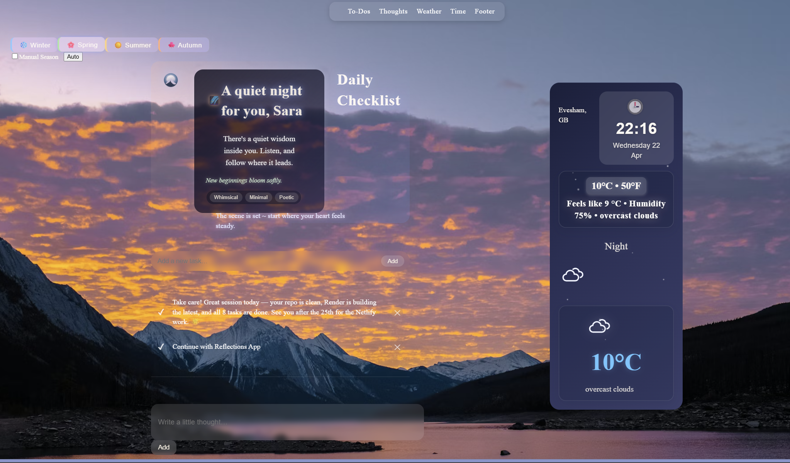

#This Project deployed on Netlify. view deployment [Here](https://inspo-home.netlify.app/)

# Getting Started with Create React App

This project was bootstrapped with [Create React App](https://github.com/facebook/create-react-app).

# Seasonal App — Overview
1. Purpose and Vision
The Seasonal App is a personalised, time‑aware interface designed to enhance user engagement through adaptive visual design. It shifts dynamically with the time of day and season, creating a more intuitive and emotionally coherent digital environment.

### 2. Key Features
- Time‑ and season‑responsive homepage
- Personalised greetings and mood‑aligned UI elements
- Persistent user inputs (checklists, notes, reflections)
- Curated, cinematic imagery for each season
- Lightweight, responsive interface suitable for daily use
- A tagline that is:

  . mood‑aware

  . season‑aware

  . glowing atmospherically

  . rotating ambiently

  . fading in cinematically

  . emotionally coherent

  . alive

### 3. Technologies Used
Frontend Framework
- React for modular, component‑driven architecture
- JavaScript (ES6+) for application logic
- CSS Modules for scoped, maintainable styling
- Responsive design for seamless performance across devices
#### Design & Assets
- Custom favicon/logo created using vector design tools
- Gradient‑based colour system aligned with emotional tone
- Curated seasonal imagery optimised for performance
#### State & Data Handling
- Local storage for persistent user data
- Modular structure enabling future expansion and integration
### 4. Architectural Overview
- Single‑page application (SPA) model
- Clear separation of concerns across components, styles, and assets
- Extensible foundation suitable for additional modules such as analytics, authentication, or cloud sync
### 5. Path to Personal App Development
#### Customisation Opportunities
• 	Personal themes, seasonal palettes, and mood‑based variants
• 	User‑defined greetings, rituals, or daily prompts
#### Feature Expansion
• 	Integration with calendars, productivity tools, or wellness trackers
• 	Cloud‑based profiles for multi‑device continuity
• 	AI‑driven recommendations based on time, weather, or behavioural patterns
#### Scalability
• 	Can evolve into a personalised productivity dashboard or wellness companion
• 	Modular codebase supports rapid iteration and experimentation
### 6. Strategic Value for Business Leaders
• 	Demonstrates the impact of adaptive, emotionally aware design on user retention
• 	Provides a model for personalised digital experiences at scale
• 	Offers a foundation for premium personalisation features or integration into broader digital ecosystems
• 	Highlights opportunities for differentiation through contextual, human‑centred design
### 7. Conclusion
The Seasonal App showcases how adaptive interfaces can elevate user experience and engagement. Its modular architecture and design principles make it a strong foundation for future personalisation initiatives and strategic product development.

## Available Scripts

In the project directory, you can run:

### `npm start`

Runs the app in the development mode.\
Open [http://localhost:3000](http://localhost:3000) to view it in your browser.

The page will reload when you make changes.\
You may also see any lint errors in the console.

### `npm test`

Launches the test runner in the interactive watch mode.\
See the section about [running tests](https://facebook.github.io/create-react-app/docs/running-tests) for more information.

### `npm run build`

Builds the app for production to the `build` folder.\
It correctly bundles React in production mode and optimizes the build for the best performance.

The build is minified and the filenames include the hashes.\
Your app is ready to be deployed!

See the section about [deployment](https://facebook.github.io/create-react-app/docs/deployment) for more information.

### `npm run eject`

**Note: this is a one-way operation. Once you `eject`, you can't go back!**

If you aren't satisfied with the build tool and configuration choices, you can `eject` at any time. This command will remove the single build dependency from your project.

Instead, it will copy all the configuration files and the transitive dependencies (webpack, Babel, ESLint, etc) right into your project so you have full control over them. All of the commands except `eject` will still work, but they will point to the copied scripts so you can tweak them. At this point you're on your own.

You don't have to ever use `eject`. The curated feature set is suitable for small and middle deployments, and you shouldn't feel obligated to use this feature. However we understand that this tool wouldn't be useful if you couldn't customize it when you are ready for it.

## Learn More

You can learn more in the [Create React App documentation](https://facebook.github.io/create-react-app/docs/getting-started).

To learn React, check out the [React documentation](https://reactjs.org/).

### Code Splitting

This section has moved here: [https://facebook.github.io/create-react-app/docs/code-splitting](https://facebook.github.io/create-react-app/docs/code-splitting)

### Analyzing the Bundle Size

This section has moved here: [https://facebook.github.io/create-react-app/docs/analyzing-the-bundle-size](https://facebook.github.io/create-react-app/docs/analyzing-the-bundle-size)

### Making a Progressive Web App

This section has moved here: [https://facebook.github.io/create-react-app/docs/making-a-progressive-web-app](https://facebook.github.io/create-react-app/docs/making-a-progressive-web-app)

### Advanced Configuration

This section has moved here: [https://facebook.github.io/create-react-app/docs/advanced-configuration](https://facebook.github.io/create-react-app/docs/advanced-configuration)

### Deployment

This section has moved here: [https://facebook.github.io/create-react-app/docs/deployment](https://facebook.github.io/create-react-app/docs/deployment)

### `npm run build` fails to minify

This section has moved here: [https://facebook.github.io/create-react-app/docs/troubleshooting#npm-run-build-fails-to-minify](https://facebook.github.io/create-react-app/docs/troubleshooting#npm-run-build-fails-to-minify)
